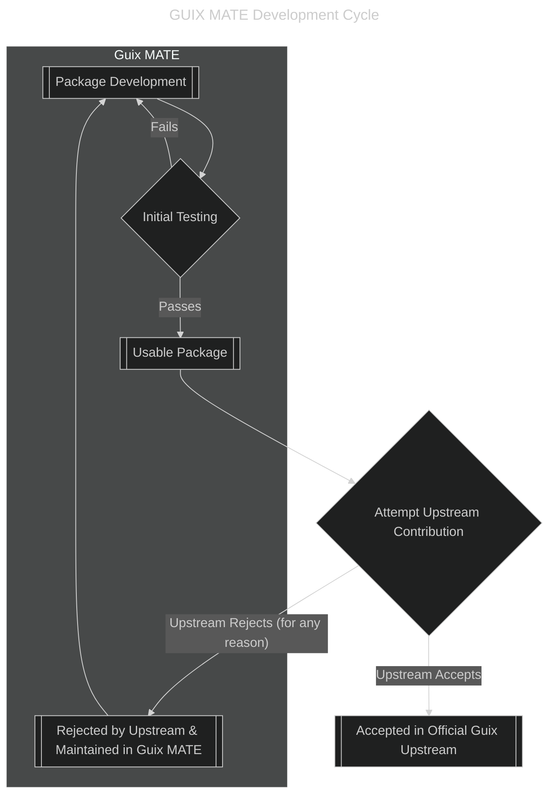

# CONTRIBUTING

Thank you for being interested in contributing to yet another Guix channel. This
small document should guide you through our goals on this project.

## Makefile based workflow

Use the provided `Makefile` to aid you with package addition or IDE setup. The
`build-system` directory contains separated files for a specific purpose. By
default you can call this build system by just running `make`:

```
=== [GUIX MATE GNU MAKEFILE + PERL  BUILD SYSTEM v1.0.0] ===

Usage:
  make [target] [variables]

Target(s):
  dev                           Starts a development guix shell for this channel
  fmt                           Format the Guile Scheme source code of this repostory
  nrepl                         Starts nrepl-server for Emacs Arei

Variable(s):
  MAKE_DIR                      The directory where the build system Makefiles are stored (default: build-system)

Example(s):
  make dev
  make fmt
```

## Software flow

Contributing to the existing Guix distribution is our primary goal. However, you
may use this channel in case you want to test the packages before we present
them to the Guix developers. If any of our packages doesn't get into the main
Guix branch, we will still provide support for it from here:

Here's the mermaid diagram of the current workflow:


