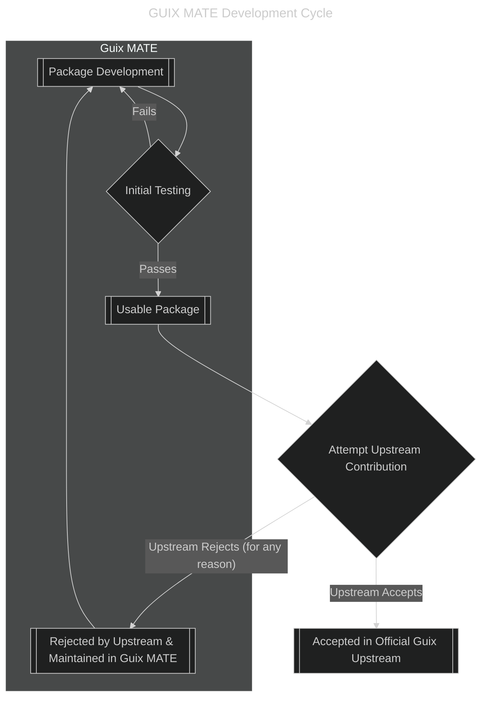

# CONTRIBUTING

Thank you for being interested in contributing to yet another Guix channel.
This small document should guide you through our goals on this project.

## Makefile based workflow

## Software flow

Contributing to the existing Guix distribution is our primary goal. However, you may use this channel in case you want to test the packages before we present them to the Guix developers. If any of our packages doesn't get into the main Guix branch, we will still provide support for
it from here:

Here's the mermaid diagram of the current workflow:

