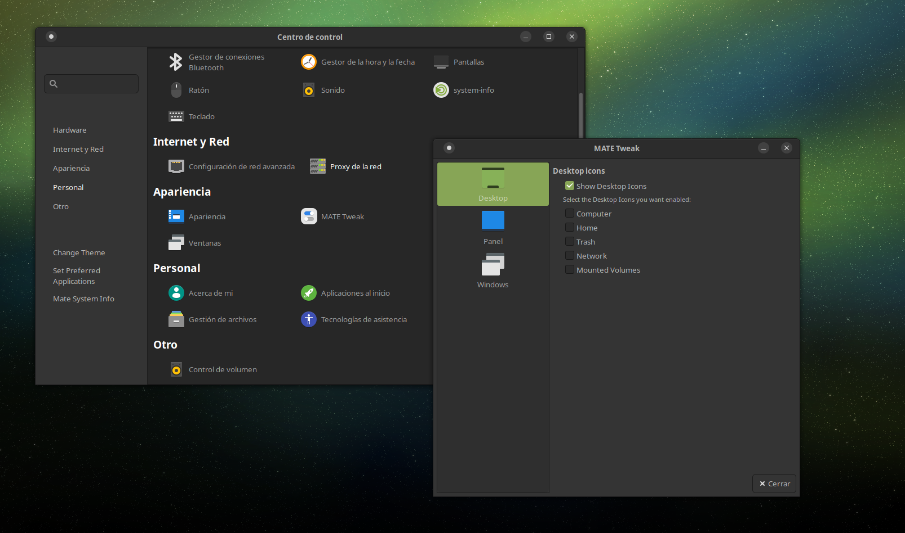

# GUIX MATE PACKAGE MATRIX

This document describes the current state of software inside this GUIX Channel.

You may use this as a tracker, guide for contribution or just plain information
about this particular channel activity.

## Linux Mint Packages

| Package                   | Upstream URL                                         | Packaging status                        | Upstreamed to Guix?            |
| ------------------------- | ---------------------------------------------------- | --------------------------------------- | ------------------------------ |
| `xed` (Pluma Fork)        | https://github.com/linuxmint/xed                     | 🧨 Broken                               | ❌                             |
| `mintmenu`                | https://github.com/linuxmint/mintmenu                | ⚠️ Deprecated, use `mate-menu` instead  | ❌                             |
| `mintdesktop`             | https://github.com/linuxmint/mintdesktop             | ⚠️ Deprecated, use `mate-tweak` instead | ❌                             |
| `mint-x-icons`            | https://github.com/linuxmint/mint-x-icons            | ✅ Working                              | ➡️ In progess                  |
| `mint-y-icons`            | https://github.com/linuxmint/mint-y-icons            | ✅ Working                              | ➡️ In progess                  |
| `mint-l-icons`            | https://github.com/linuxmint/mint-l-icons            | ✅ Working                              | ➡️ In progess                  |
| `mint-themes`             | https://github.com/linuxmint/mint-themes             | 🛠️ In progress                          | ❌                             |
| `xdg-desktop-portal-xapp` | https://github.com/linuxmint/xdg-desktop-portal-xapp | ❌ Not started                          | ❌                             |
| `python-xapp`             | https://github.com/linuxmint/python-xapp             | ✅ Working                              | ✅ `gnu/packages/cinnamon.scm` |
| `xviewer`                 | https://github.com/linuxmint/xviewer                 | ❌ Not started                          | ❌                             |
| `xviewer-plugins`         | https://github.com/linuxmint/xviewer-plugins         | ❌ Not started                          | ❌                             |
| `sticky`                  | https://github.com/linuxmint/sticky                  | ❌ Not started                          | ❌                             |
| `xapp-thumbnailers`       | https://github.com/linuxmint/xapp-thumbnailers       | ❌ Not started                          | ❌                             |
| `webapp-manager`          | https://github.com/linuxmint/webapp-manager          | ❌ Not started                          | ❌                             |
| `warpinator`              | https://github.com/linuxmint/warpinator              | ❌ Not started                          | ❌                             |
| `xreader`                 | https://github.com/linuxmint/xreader                 | ❌ Not started                          | ❌                             |
| `timeshift`               | https://github.com/linuxmint/timeshift               | ❌ Not started                          | ❌                             |
| `pix`                     | https://github.com/linuxmint/pix                     | ❌ Not started                          | ❌                             |
| `lightdm-settings`        | https://github.com/linuxmint/lightdm-settings        | ❌ Not started                          | ❌                             |

## Ayatana Indicators

| Package              | Upstream URL                         | Packaging status | Upstreamed to Guix? |
| -------------------- | ------------------------------------ | ---------------- | ------------------- |
| `ayatana-indicators` | https://github.com/AyatanaIndicators | ❌ Not started   | ❌                  |

## Plank

| Package | Upstream URL                    | Packaging status | Upstreamed to Guix? |
| ------- | ------------------------------- | ---------------- | ------------------- |
| `plank` | https://github.com/ricotz/plank | ❌ Not started   | ❌                  |

## Trisquel GNU/Linux-libre Packages

| Package           | Upstream URL                                            | Packaging status | Upstreamed to Guix? |
| ----------------- | ------------------------------------------------------- | ---------------- | ------------------- |
| `trisquel-themes` | https://gitlab.trisquel.org/trisquel/trisquel-packages/ | 🛠️ In progress   | ❌                  |

## MATE Desktop

| Package                    | Upstream URL                                             | Packaging status | Upstreamed to Guix?        |
| -------------------------- | -------------------------------------------------------- | ---------------- | -------------------------- |
| `mate-indicator-applet`    | https://github.com/mate-desktop/mate-indicator-applet    | ❌ Not started   | ❌                         |
| `pluma-plugins`            | https://github.com/mate-desktop/pluma-plugins            | ❌ Not started   | ❌                         |
| `caja-actions`             | https://github.com/mate-desktop/caja-actions             | ❌ Not started   | ❌                         |
| `python-caja`              | https://github.com/mate-desktop/python-caja              | ✅ Completed     | ✅ `gnu/packages/mate.scm` |
| `mate-notification-daemon` | https://github.com/mate-desktop/mate-notification-daemon | 🛠️ In progress   | ❌                         |
| `mate-sensors-applet`      | https://github.com/mate-desktop/mate-sensors-applet      | ✅ Completed     | ❌                         |

#### *won't upstream notices

Packages are marked as _wont' upstream_ won't be sent to upstream Guix for a
variety of reasons:

1. Packages with abandoned issues or merge requests.
2. These packages have took too much effort to create and there was not enough
   documentation or source code examples in upstream Guix.
3. Forks of discontinued projects, as that would mean I'll have to maintain a
   forked legacy project for a bigger userbase

This doesn't mean **you** cannot copy and attempt to send patches upstream for
these packages, it means I won't be maintaining those outside of this channel,
so updates, patches and bugs will be **yours** to take care of, or wait until I
notice and repeat the process **yourself**.

## Screenshots

A picture is worth more than a thousand words, here are some packages live in
action from this repository.

### Ubuntu MATE

Take a look for yourself at the Ubuntu MATE packages we ship!

#### MATE TWEAK

