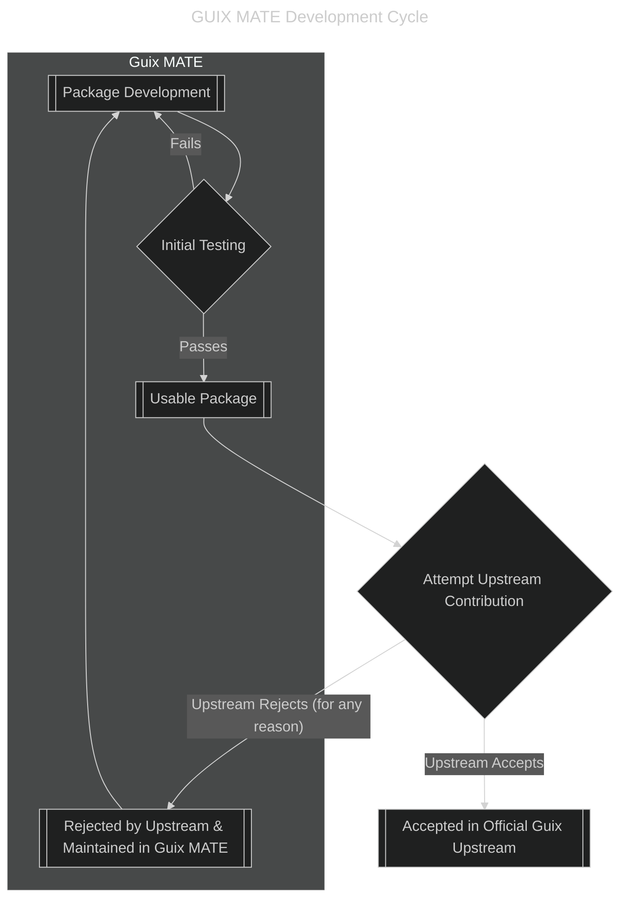
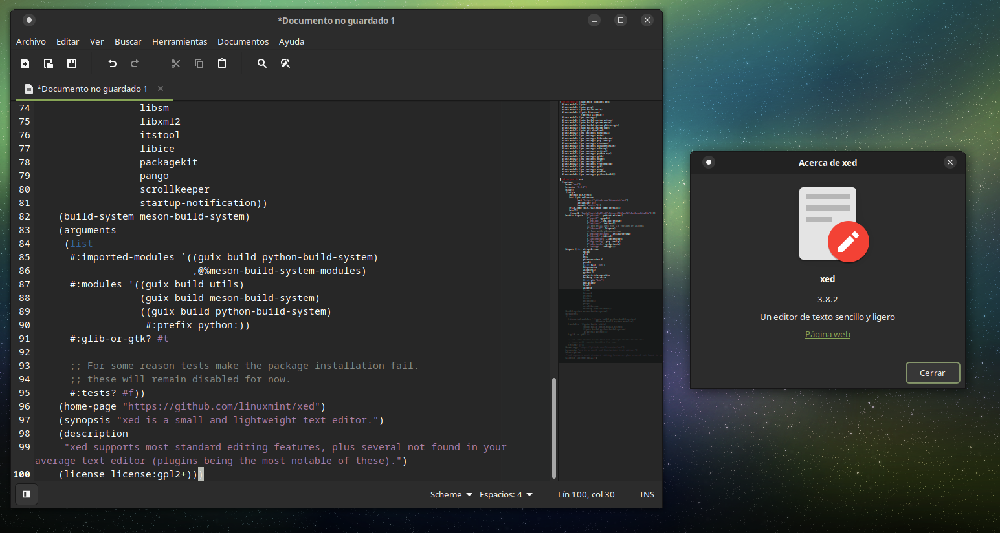

# GUIX MATE 🦬🧉

This channel tries to improve your MATE Desktop experience in GNU GUIX systems.

- Tired of your favorite GTK applications looking like `libadwaita`? We've got cross-platform xapps from Linux Mint adapted to GUIX. 
- Jealous of that Ubuntu audio indicator with music player controls?
- Running away from rust? MATE is almost pure C.

Return to the comfy *traditional* desktop everyone loved in the 2000's 

_This channel is still experimental. You can see package progress [here](https://codeberg.org/guix-mate/-/projects/13979)_

## Usage

This channel is not ready to be used. Grab an issue if you wish to help.

## Workflow

Contributing to the existing Guix distribution is our primary goal. However, you may use this channel in case you want to test the packages before we present them to the Guix developers. If any of our packages doesn't get into the main Guix branch, we will still provide support for
it from here:

Here's the mermaid diagram of the current workflow:

## Upstreamed packages

The following packages are now part of GNU GUIX and are no longer present in this repository:

- `python-xapp`: Python bindings for `libxapp`

## Goals

- Rival Ubuntu MATE on software available for the MATE desktop.
- Patch upstream sources to remove `apt/dpkg` specific behavior
- Updates at least once per week/month, there's much room for improvement
- Rebrand if possible to improve user experience and integration with GUIX
- Upstream packages to GNU Guix to benefit trisquel users migrating

## Available software

The following list shows the available packages you can install + the packages we wish to maintain in this repository:

### Mint
- [ ] `mintdesktop` (The original mate-tweak)
- [ ] `mintMenu` (The original `advanced-mate-menu`)
- [x] `xed` (Pluma fork, more complete than pluma, cross platform between XFCE/MATE/Cinnamon)
  - 
- [ ] [`xdg-desktop-portal-xapp`](https://github.com/linuxmint/xdg-desktop-portal-xapp) Make Cinnamon, MATE & XFCE compatible with desktop portals.
- [ ] [`xviewer`](https://github.com/linuxmint/xviewer) (xapp image viewer, looks the same on XFCE/MATE/Cinnamon)
  - **[WIP]: Taking longer than expected because xviewer requires a newer `libxapp` which I don't know how to update manually**
- [ ] [`sticky`](https://github.com/linuxmint/sticky) (Note taking application.)
- [ ] [`xapp-thumbnailers`](https://github.com/linuxmint/xapp-thumbnailers) (Thumbnail generators)
- [ ] [`webapp-manager`](https://github.com/linuxmint/webapp-manager/tree/master)
- [ ] [`warpinator`](https://github.com/linuxmint/warpinator)
- [ ] [`xreader`](https://github.com/linuxmint/xreader) 
- [ ] [`timeshift`](https://github.com/linuxmint/timeshift)
- [ ] [`pix`](https://github.com/linuxmint/pix)
- [ ] [`lightdm-settings`](https://github.com/linuxmint/lightdm-settings) (Lightdm settings UI)
- [ ] `mint-themes` (The whole bundle of mint-x mint-y and mint-l both GTK + Icon themes)
  - [ ] `mint-x`
    - [ ] `mint-x-icons`
    - [ ] `mint-x-gtk`
  - [ ] `mint-y`
    - [ ] `mint-y-icons`
    - [ ] `mint-y-gtk`
  - [ ] `mint-l`
    - [ ] `mint-l-icons`
    - [ ] `mint-l-gtk`
- [ ] `xviewer-plugins`

### Ubuntu MATE
- [ ] Yaru MATE themes by default
- [ ] `mate-hud` with `rofi`
- [ ] `mate-dock-applet`
- [ ] `indicator-emojitwo`
- [ ] Ayatana indicators
- [ ] `brisk-menu` (It has a memory leak and hasn't been updated in 4 years (nor is it stable). Seems to work fine on latest ubuntu mate)
- [ ] `ubuntu-mate-artwork` (Wallpapers, icons and themes)
- [ ] [`mate-window-applets`](https://github.com/ubuntu-mate/mate-window-applets)
- [ ] Plank

### Trisquel
- [ ] Trisquel Themes (greybird?)
- [ ] Trisquel Icons (subsitute trisquel logo for GUIX logo by luis felipe)
- [ ] Package abrowser (most of it's installation is rebranding only in the Debian package. Some way to avoid using a proprietary channel is greatly appreciated)

## Excluded software

### Ubuntu MATE
- [`mate-optimus`](https://github.com/ubuntu-mate/mate-optimus) only useful for proprietary drivers.

